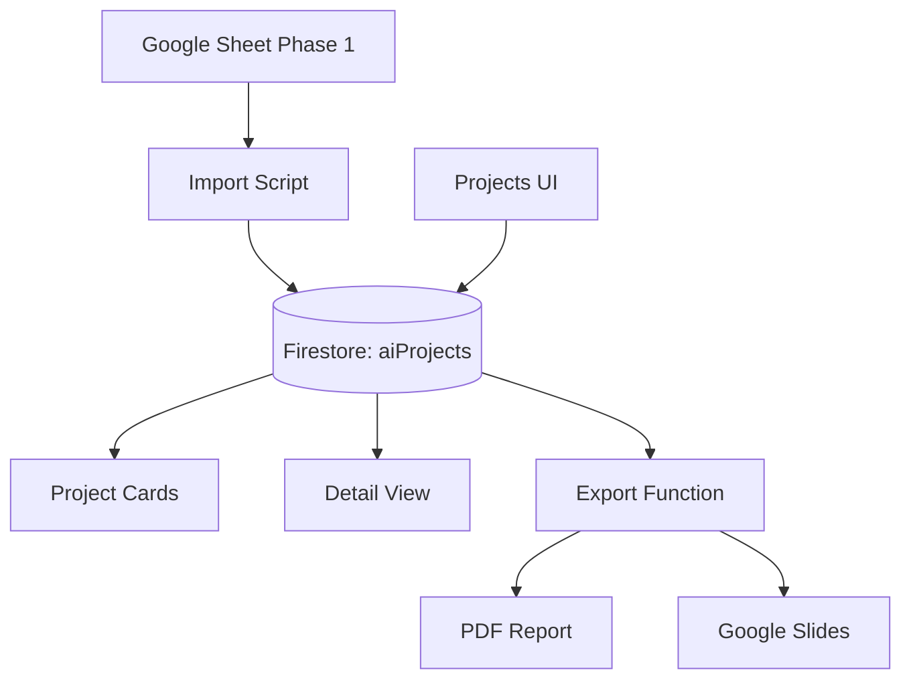

# 🎯 AI Improvements Dashboard - Technical Design

## Übersicht

Integration einer neuen "AI Projects" Sektion im AI Trailblazers Dashboard zur strukturierten Dokumentation und Präsentation von AI-Projekten.

---

## Architektur



---

## Phase 2: Dashboard Integration (1-2 Sessions)

### Neue Dateien

#### 1. TypeScript Interface: `lib/types/projects.ts`

```typescript
export interface AIProject {
  id: string;
  name: string;
  description: string;
  
  // Ownership
  owner: string; // email
  coOwners: string[]; // emails
  
  // Status & Category
  status: 'Idea' | 'In Progress' | 'Live' | 'On Hold';
  category: 'Process Automation' | 'Analytics' | 'Training' | 'Compliance' | 'Other';
  
  // Benefits (Key Focus!)
  benefitsTeam: string;
  benefitsCompany: string;
  benefitsCustomers: string;
  
  // Metrics / Impact
  metricsBefore: string;
  metricsAfter: string;
  keyImpactNumber: string; // e.g. "96% time saved"
  
  // Showcase
  technologies: string[]; // ['Gemini 2.0', 'Next.js']
  demoLink?: string;
  screenshots?: string[]; // URLs
  
  // Timeline
  startedDate: Date;
  completedDate?: Date;
  
  // Additional
  nextSteps?: string;
  learnings?: string;
  
  // Metadata
  createdAt: Date;
  updatedAt: Date;
  createdBy: string; // email
}

export interface ProjectFormData {
  name: string;
  description: string;
  owner: string;
  coOwners: string[];
  status: AIProject['status'];
  category: AIProject['category'];
  benefitsTeam: string;
  benefitsCompany: string;
  benefitsCustomers: string;
  metricsBefore: string;
  metricsAfter: string;
  keyImpactNumber: string;
  technologies: string[];
  demoLink?: string;
  startedDate: Date;
  completedDate?: Date;
  nextSteps?: string;
  learnings?: string;
}
```

#### 2. Firebase Functions: `lib/firebase/aiProjects.ts`

```typescript
import {
  collection,
  doc,
  addDoc,
  updateDoc,
  deleteDoc,
  getDoc,
  getDocs,
  query,
  where,
  orderBy,
  Timestamp,
  setDoc,
} from 'firebase/firestore';
import { getDb } from './config';
import { AIProject, ProjectFormData } from '../types/projects';

const COLLECTION = 'aiProjects';

function getDbOrThrow() {
  const db = getDb();
  if (!db) throw new Error('Firebase not initialized');
  return db;
}

// CREATE
export async function createProject(
  data: ProjectFormData,
  createdBy: string
): Promise<string> {
  const db = getDbOrThrow();
  const docRef = await addDoc(collection(db, COLLECTION), {
    ...data,
    startedDate: Timestamp.fromDate(data.startedDate),
    completedDate: data.completedDate ? Timestamp.fromDate(data.completedDate) : null,
    createdAt: Timestamp.now(),
    updatedAt: Timestamp.now(),
    createdBy,
    screenshots: [],
  });
  return docRef.id;
}

// READ ALL
export async function getAllProjects(): Promise<AIProject[]> {
  const db = getDbOrThrow();
  const q = query(
    collection(db, COLLECTION),
    orderBy('createdAt', 'desc')
  );
  const snapshot = await getDocs(q);
  
  return snapshot.docs.map(doc => ({
    id: doc.id,
    ...doc.data(),
    startedDate: doc.data().startedDate?.toDate() || new Date(),
    completedDate: doc.data().completedDate?.toDate() || null,
    createdAt: doc.data().createdAt?.toDate() || new Date(),
    updatedAt: doc.data().updatedAt?.toDate() || new Date(),
  })) as AIProject[];
}

// READ BY STATUS
export async function getProjectsByStatus(status: AIProject['status']): Promise<AIProject[]> {
  const db = getDbOrThrow();
  const q = query(
    collection(db, COLLECTION),
    where('status', '==', status),
    orderBy('createdAt', 'desc')
  );
  const snapshot = await getDocs(q);
  
  return snapshot.docs.map(doc => ({
    id: doc.id,
    ...doc.data(),
    startedDate: doc.data().startedDate?.toDate() || new Date(),
    completedDate: doc.data().completedDate?.toDate() || null,
    createdAt: doc.data().createdAt?.toDate() || new Date(),
    updatedAt: doc.data().updatedAt?.toDate() || new Date(),
  })) as AIProject[];
}

// READ ONE
export async function getProject(id: string): Promise<AIProject | null> {
  const db = getDbOrThrow();
  const docSnap = await getDoc(doc(db, COLLECTION, id));
  
  if (!docSnap.exists()) return null;
  
  const data = docSnap.data();
  return {
    id: docSnap.id,
    ...data,
    startedDate: data.startedDate?.toDate() || new Date(),
    completedDate: data.completedDate?.toDate() || null,
    createdAt: data.createdAt?.toDate() || new Date(),
    updatedAt: data.updatedAt?.toDate() || new Date(),
  } as AIProject;
}

// UPDATE
export async function updateProject(
  id: string,
  data: Partial<ProjectFormData>
): Promise<void> {
  const db = getDbOrThrow();
  const updateData: any = {
    ...data,
    updatedAt: Timestamp.now(),
  };
  
  if (data.startedDate) {
    updateData.startedDate = Timestamp.fromDate(data.startedDate);
  }
  if (data.completedDate) {
    updateData.completedDate = Timestamp.fromDate(data.completedDate);
  }
  
  await updateDoc(doc(db, COLLECTION, id), updateData);
}

// DELETE
export async function deleteProject(id: string): Promise<void> {
  const db = getDbOrThrow();
  await deleteDoc(doc(db, COLLECTION, id));
}

// IMPORT FROM SHEET (Helper)
export async function importProjectFromSheet(sheetRow: any): Promise<string> {
  const db = getDbOrThrow();
  
  const projectData = {
    name: sheetRow['Project Name'],
    description: sheetRow['Description'] || '',
    owner: sheetRow['Owner'],
    coOwners: sheetRow['Co-Owners']?.split(',').map((s: string) => s.trim()) || [],
    status: sheetRow['Status'] as AIProject['status'],
    category: sheetRow['Category'] as AIProject['category'],
    benefitsTeam: sheetRow['Benefits (Team)'] || '',
    benefitsCompany: sheetRow['Benefits (Company)'] || '',
    benefitsCustomers: sheetRow['Benefits (Customers)'] || '',
    metricsBefore: sheetRow['Metrics (Before)'] || '',
    metricsAfter: sheetRow['Metrics (After)'] || '',
    keyImpactNumber: sheetRow['Key Impact Number'] || '',
    technologies: sheetRow['Technologies']?.split(',').map((s: string) => s.trim()) || [],
    demoLink: sheetRow['Demo/Screenshot Link'] || null,
    screenshots: [],
    startedDate: Timestamp.fromDate(new Date(sheetRow['Started Date'])),
    completedDate: sheetRow['Completed Date'] ? Timestamp.fromDate(new Date(sheetRow['Completed Date'])) : null,
    nextSteps: sheetRow['Next Steps'] || null,
    learnings: sheetRow['Learnings'] || null,
    createdAt: Timestamp.now(),
    updatedAt: Timestamp.now(),
    createdBy: 'import@system',
  };
  
  const docRef = await addDoc(collection(db, COLLECTION), projectData);
  return docRef.id;
}
```

#### 3. UI Route: `app/projects/page.tsx`

Erstelle neue Seite mit:
- Card View aller Projekte
- Filter (Status, Owner, Category)
- Search
- "Add Project" Button
- Export Button

#### 4. Detail View: `app/projects/[id]/page.tsx`

Zeigt vollständige Projekt-Details.

#### 5. Add/Edit Form: `app/projects/new/page.tsx` und `app/projects/[id]/edit/page.tsx`

Formular für Projekterstellung/-bearbeitung.

---

## Firestore Security Rules

In `firestore-rules-COMBINED-FINAL.txt` hinzufügen:

```javascript
// AI Projects Collection (AI Improvements Tracker)
match /aiProjects/{projectId} {
  // Anyone can read (for showcase purposes)
  allow read: if isAITrailblazersUser();
  
  // Admins can write anything
  allow write: if isAITrailblazersAdmin();
  
  // Users can create projects (owner = their email)
  allow create: if isAITrailblazersUser() && 
                   request.resource.data.owner == request.auth.token.email;
  
  // Users can update their own projects
  allow update: if isAITrailblazersUser() && 
                   (resource.data.owner == request.auth.token.email || 
                    isAITrailblazersAdmin());
  
  // Only admins can delete
  allow delete: if isAITrailblazersAdmin();
}
```

---

## UI Components (Zusammenfassung)

### 1. Project Card Component

```typescript
interface ProjectCardProps {
  project: AIProject;
  onClick: () => void;
}
```

Zeigt:
- Project Name
- Status Badge
- Owner
- Key Impact Number
- Technologies (Tags)

### 2. Status Badge Component

Farbcodierung:
- Live: Grün
- In Progress: Gelb
- Idea: Blau
- On Hold: Grau

### 3. Filter Sidebar

Filter nach:
- Status (Checkboxes)
- Owner (Dropdown)
- Category (Checkboxes)

### 4. Export Button

Exportiert zu:
- PDF (priority)
- Google Slides (optional, Phase 3)

---

## Import Script (für Sheet-Migration)

`scripts/import-projects-from-sheet.ts`

Liest Google Sheet via API und importiert Projekte nach Firestore.

---

## Navigation Update

In der Haupt-Navigation hinzufügen:

```typescript
{
  name: 'AI Projects',
  href: '/projects',
  icon: RocketIcon,
}
```

---

## Nächste Schritte

### Session 1 (1-2 Stunden):
1. TypeScript Interfaces erstellen
2. Firebase Functions implementieren
3. Firestore Rules hinzufügen

### Session 2 (2-3 Stunden):
4. Projects List Page (`/projects`)
5. Project Card Component
6. Filter & Search

### Session 3 (1-2 Stunden):
7. Detail View (`/projects/[id]`)
8. Add/Edit Forms

### Session 4 (Optional, 1-2 Stunden):
9. Import Script für Sheet-Daten
10. Export zu PDF

---

## Testing Checklist

- [ ] Create new project
- [ ] View all projects
- [ ] Filter by status
- [ ] Filter by owner
- [ ] Search projects
- [ ] View project details
- [ ] Edit project
- [ ] Delete project (admin only)
- [ ] Import from sheet
- [ ] Export to PDF

---

Bereit für die Implementierung in der nächsten Session!
